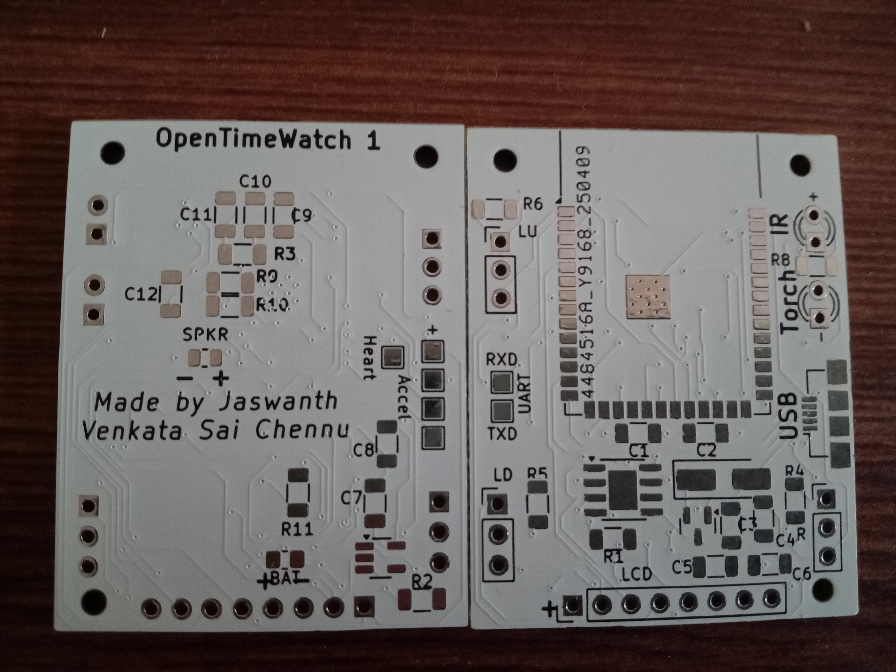

## LILYGO TQT Pro
Specs:-
1. Processor:- ESP32 S3
2. RAM:- 2MB
3. Flash:- 4MB/8MB
4. 2 Buttons
5. Torch
6. Speaker
7. 0.85" GC9107 128 x 128 IPS display
8. MPU6050
9. USB-C

This watch uses a LILYGO TQT Pro as the watch with speaker, torch LED and an accelerometer attatched to it. The watch supports time synchronisation using NTP, multiple watch faces, pong game, custom background for watch face, matrix animation, torch support and battery charging.

Note:- This is only used as a POC and may not be supported in the future versions of OpenTimeWatch OS.

## OpenTimeWatch 1 Rev 1
Specs:-
1. Processor:- ESP32 S3
2. RAM:- 8MB
3. Flash:- 16MB
4. 3 Buttons
5. Torch
6. Speaker
7. 1.44" 128 x 128 TFT display
8. IR transmitter
9. MPU6050
10. Pulse sensor
11. Micro USB-B

The first watch form the OpenTimeWatch Project, it is currently just a PCB with proper accelerometer support for step tracking, larger screen, more RAM and storage, IR transmitter support, pulse sensor support, nattery charging and micro USB for charging and uploading firmware.

Note:- This watch is WIP and has multiple issues, might get superseded by Rev 2.

