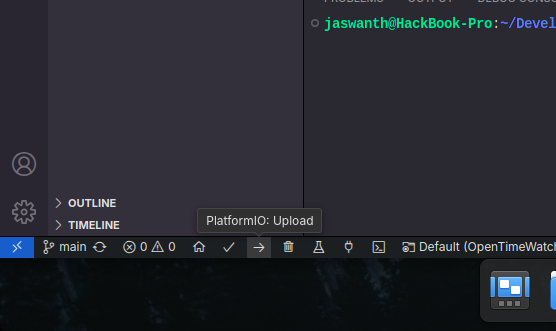

This guide is for beginners and people who don't want to manually configure the firmware, it allows the user to configure the firmware using the configuration tool. 

## Requirements
1. VSCode with PlatformIO IDE
2. Python

## Configuration
1. Download the ```.zip``` file of the firmware source code from [here](https://github.com/OpenTimeWatch-Project/OpenTimeWatch-OS/releases)
2. Unzip the source code file
3. Open the unzipped folder using VSCode
4. Open terminal
5. Execute the tool:- ```python otwConfigurator.py``` or ```python3 otwConfigurator.py```
6. Start configuring using the command line tool

After succesfully configuring the firmware, you can now upload the firmware to your watch.

## Uploading
1. Connect your watch to your computer using a USB cable.
2. Upload the firmware by clicking the upload button on thee bottom left side of the screen or press ++ctrl+alt+u++



After successfully uploading the firmware you can start using the watch.